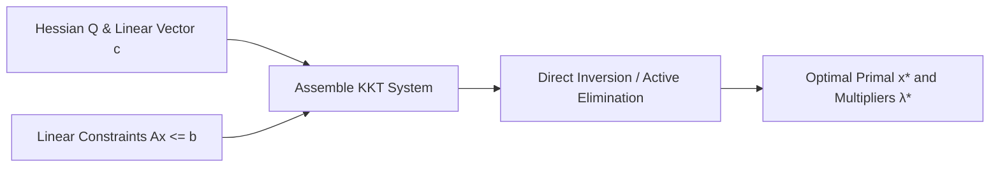

# Active-Set Quadratic Programming Skill

Direct Karush-Kuhn-Tucker (KKT) active-set quadratic programming solver for linear quadratic regulation (LQR) and model predictive control (MPC).

## Features
- **100% Python Standard Library**: Pure analytical inversion.
- **Model Predictive Control Core**: Direct compatibility with robotic tracking problems.
